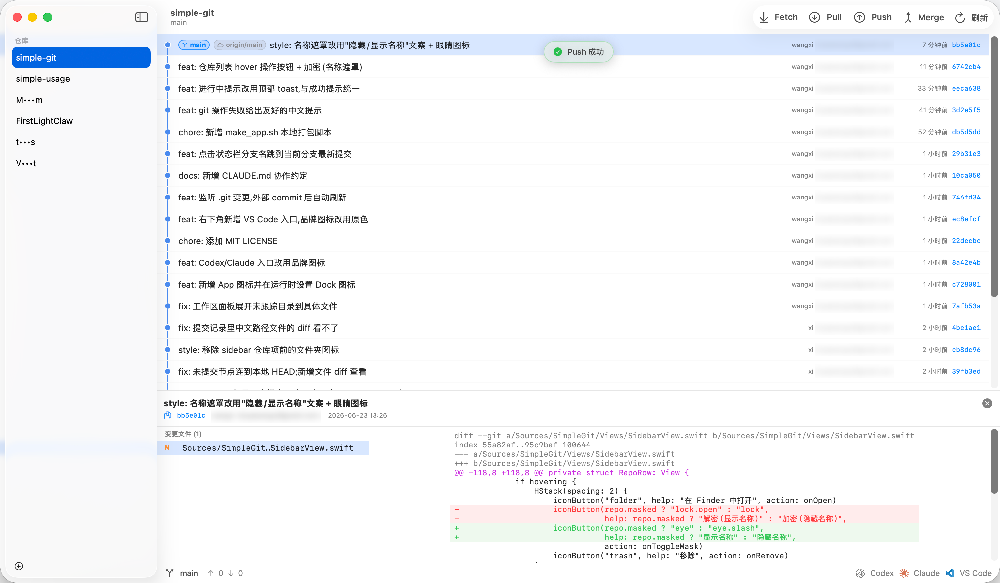

<p align="center">
  
</p>

<h1 align="center">simple-git</h1>

<p align="center">A minimal, native macOS Git client — multi-repo sidebar, a hand-drawn commit graph, and just Fetch / Pull / Push / Merge.</p>

<p align="center">
  
  
  
</p>



## Why

Most Git GUIs (SourceTree, Fork, …) pile on every feature imaginable. If you let an AI agent write most of your code, you don't need most of that — you need to *see* the tree and occasionally sync. simple-git keeps exactly that: a multi-repo sidebar, a readable commit graph, and the few buttons you actually press. Nothing else.

## Features

- **Multi-repo sidebar** — add a local repo or clone a URL; the list persists. Hover a repo for quick actions: open in Finder, hide/show its name, remove (with confirmation).
- **Hand-drawn commit graph** — swim-lane layout with colored chips for local / remote branches and tags, plus author, relative time, and short hash.
- **Working-tree node** — uncommitted changes show as a node at the tip; click any file to see its diff (new / untracked files included).
- **Read-only diffs** — view commit and working-tree diffs; non-ASCII (e.g. Chinese) paths render correctly.
- **Core actions only** — Fetch (`--all --prune`), Pull, Push (auto `-u` on first push), Merge a selected commit, Refresh (`⌘R`).
- **Live auto-refresh** — an FSEvents watcher on `.git` updates the UI the moment you commit / switch branches / fetch from a terminal or AI agent — no manual refresh.
- **Jump to HEAD** — click the branch in the status bar to scroll to and select the latest commit on your branch.
- **Friendly feedback** — readable error messages (no raw git `hint:` dumps) and top toasts for in-progress / success.
- **Privacy masking** — hide a repo's name (`s•••t`) for screen-sharing or screenshots.
- **One-click launchers** — open the current repo in Codex, Claude, or VS Code.
- **Native & light** — SwiftUI + AppKit, all git via the `git` CLI, zero third-party dependencies.

## Read-only by design

simple-git shows you state and runs sync commands; it does **not** stage or create commits from the UI — you do that in your terminal or via an AI agent, then watch the graph update live. Merge conflicts are surfaced but resolved in the terminal.

## Requirements

- macOS 13 (Ventura) or newer
- `git` available on your `PATH`
- Swift 5.9+ / Xcode 15+ to build from source

## Build & Run

Run from source:

```bash
swift run
```

Or build a double-clickable, ad-hoc-signed app and install it:

```bash
./Assets/make_app.sh /Applications   # omit the path to only build into dist/
```

## Easiest Way To Use

Open this project with Codex or Claude Code and ask the agent to build and run it:

```text
Build this project into simple-git.app and run it.
```

The agent can run `Assets/make_app.sh` and open the generated app.

## App Icon

The icon comes from a single SVG source — don't hand-edit the generated PNG / icns:

```bash
./Assets/generate_icon.sh
```

This regenerates `app-icon-1024.png`, `AppIcon.icns`, and `AppIcon.appiconset` from `Assets/icon.svg`.

## Architecture

SwiftUI + AppKit. All git operations shell out to the `git` CLI via `Foundation.Process` (reads run with `GIT_OPTIONAL_LOCKS=0`, so the app never writes to `.git`).

```
Sources/SimpleGit/
  App.swift              # @main App + AppDelegate (window focus, Dock icon)
  AppStore.swift         # @MainActor state hub; reload() is the single load entry
  Models.swift           # Repository / Commit / Branch / RepoStatus / graph model
  Git/
    GitRunner.swift      # async Process wrapper around `git`
    GitService.swift     # high-level commands: log / status / refs / diff / sync
    GraphLayout.swift    # commit-graph swim-lane assignment
    RepoWatcher.swift    # FSEvents watcher on .git → auto-refresh
  Views/                 # ContentView / SidebarView / RepoDetailView /
                         # CommitGraphView / WorkingChangesPanel / DiffView / …
```

## Known Limitations

- No stage / commit UI (intentional — commit from the terminal or an agent).
- Merge conflicts must be resolved in the terminal.
- The graph loads the most recent 400 commits (`--all --topo-order`).

## FAQ

**Is this a lightweight alternative to SourceTree on macOS?**
Yes — it deliberately drops most features and keeps a multi-repo view, a commit graph, and Fetch / Pull / Push / Merge.

**Will it change my repository?**
Only when you press Fetch / Pull / Push / Merge. Everything else is read-only, and reads run with `GIT_OPTIONAL_LOCKS=0` so they don't even touch `.git`.

**Does it auto-update when I commit from a terminal or an AI agent?**
Yes. It watches `.git` with FSEvents and refreshes the graph and status automatically.

**Any third-party dependencies or telemetry?**
None. It only runs the local `git` you already have.

## 简体中文

simple-git 是一个极简的原生 macOS Git 客户端:左侧多仓库切换,右侧自绘 commit graph,工具栏只保留 Fetch / Pull / Push / Merge。它面向"代码主要交给 AI 写、人只需要看 tree 状态并偶尔同步"的工作方式,刻意不做 SourceTree 那一大堆功能。

所有 git 操作通过本地 `git` 命令完成,无第三方依赖、无遥测;读操作带 `GIT_OPTIONAL_LOCKS=0`,不会写 `.git`。在终端或 agent 里 commit 后,界面通过监听 `.git` 自动刷新。还支持:把仓库名打码用于截图、一键用 Codex / Claude / VS Code 打开当前仓库、点状态栏分支名跳到最新提交。

构建运行见上方 **Build & Run**;或用 Codex / Claude Code 打开本项目,让 agent 直接帮你 `Assets/make_app.sh` 打包运行。

## License

[MIT](LICENSE) © 2026 wangxi
